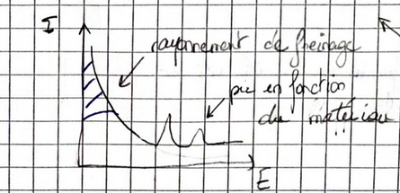
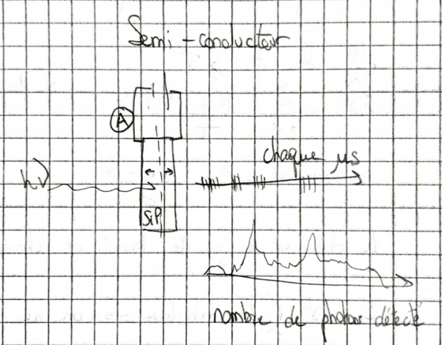
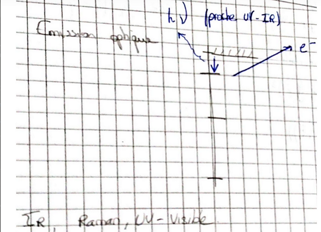

# Techniques

Préparation d'échantillons : lithopréparation, séparations, extractions...

Observations et analyses : techniques chimiques, physiques, spectrométrie (masse), spectroscopies (photons, électrons, protons, ions...)

Compréhension des résultats : statistiques, traitements d'images..

# Objectifs

- Savoir sur quelle technique se tourner pour résoudre un problème en géosciences
- Savoir reconnaître une technique à partir d'éléments limités (spectre, unités...)
- Comprendre les processus physiques sous-tendant les techniques d'analyse 
- Connaître les limites actuelles des différentes techniques
- Connaître les principales contraintes sur la préparation des échantillons

https://sourceforge.net/project/pymca 

Observation de la force électromagnétique. Toutes les particules se comportent avec une equation de rotation. Les caractéristiques spins sont les porteurs du magnétisme.

Liaison covalente : mise en commun de deux électrons

Agitation dans l'infrarouge

Atome = noyau + électrons occupant des orbitales atomiques qui ne sont pas des orbitales circulaires

Spin -> changement de rotation de l'axe d'une particule

En transférant de l'énergie à un électron, on peut aussi lui faire changer d'orbitale atomique

Règle de Klechkowski permettant de reconstruire l’ordre des énergies croissantes des énergies croissantes des sous-couches électroniques.

Molécule : assemblage d'atomes liés par des liaisons chimiques

Liaisons chimique : mise en commun d'électrons dans des orbitales moléculaires

Orbitale moléculaire :  combinaison linéaire d'orbitales atomiques

Comme pour les orbitales atomiques, seules les orbitales de plus basse énergie sont remplies. Les orbitales de plus haute énergie sont vides à l’état fondamental. Comme pour les orbitales atomiques, en transférant de l’énergie à un électron, on peut le faire changer d’orbitale moléculaire. Pour simplifier et par analogie avec les atomes: les noyaux sont formés de plusieurs nucléons qui peuvent occuper dans le noyaux des niveaux discrets d’énergie. Il existe donc un état d’énergie. Il existe donc un état fondamental (énergie minimale) et des états excités. En transférant de l’énergie à un noyau, on peut le faire passer dans un état excité. Les techniques spectroscopiques vont toutes faire interférer des ondes électromagnétiques avec les orbitales atomiques ou moléculaires ou encore atomiques ou moléculaires ou encore avec les spins électroniques ou nucléaires.

IRM : rayonnement du noyau d'hydrogène

Raman : niveau de vibration des molécules

IR : niveau de vibration de même molécules

Diffusion : électron qui change de phase, d'énergie ou de trajectoire

## Ondes électromagnétiques

représentent la propagation d’un champ électrique et d’un champ magnétique alternatifs et perpendiculaires. Sont portées par un photon.

3 caractéristiques chimiques : 

- techniques élémentaires : caractéristiques sur les éléments
- techniques moléculaire : caractéristiques sur la molécule
- spéciation : environnement chimique local

Pour chaque techniques :

- le principe physique (domaine spectral et le mode d'interaction entre les photons et la matière)
- appareillage (exciter et détecter)
- spectre 
- infos diverses
- a quoi ça sert

## Fluorescence X, XRF

XRF (X-Ray Fluorescence) : émission de rayon X lié à la relaxation d'un atome. Il est excité car il a une lacune en couche profonde. La **relaxation** est faite par le **transfert** d'un électron d'une **couche externe vers une couche profonde**. L'ionisation en couche profonde est dûe par l'absorption d'un photon X incident.

Rayons X sont ceux de haute énergie. L'unité d'énergie est en keV en abscisse. En ordonnée on a une émission en Intensité du signal (AU ou cp ou cp/s).

Pour générer des rayons x : Sources

1. on utilise un élément radioactif (100 euros)
2. tube à rayons x : on fait interagir des électrons avec une cible en métal (100K d'euros)

3. rayonnement synchrotron : appareil dans lequel on fait tourner des photons à la vitesses de la lumière (1 milliard d'euros)
 
Détection :

- Dispersion en énergie : utiliser les photons de la lumière et les trier en fonction de l'énergie du photon sur un semi-conducteur. Pas toujours de photons car XRF est en compétition avec des électrons Auger. On voit tous les élements.

- dispersion en longueur d'onde : le détecteur va permettre de compter les photons. Les photons arrivent au cristal analyseur et repartent vers le détecteur. Les rayons arrivent en parallèles 2d sinθ. Les chemins ont la même longueur entre la source, le cristal et le détecteur. Pas de spectre. On sélectionne les élements. Equation de Bragues.

Infos diverses : Les éléments doivent avoir une couche L. Seulement à partir du Bore qu'on peut l'observer. Plus on avance dans le tableau, les résultats sont meilleurs pas de H, He, Li, Be et les plus légers. 

Utilité : La fluorescence permet une analyse élémentaire qualitative et/ou quantitative. Il existe des ensembles source/détecteur portables (pistolet) manipulables sur le terrain. Méthode peu sensible aux conditions de T, P,... et aux liaisons chimiquesMéthode non destructive. Peut permettre de regarder les peintures au plomb.

### Libs

Transfert électronique entre le continuum et une couche interne. Technique élémentaire : composition élémentaire de l'échantillon. Emission optique induite par laser. On fait une émission optique. Un électron est éjecté, un électron sera mis à sa place en émettant un photon proche UV-IR.

**Domaine spectral** : proche UV- IR

Spectre avec des longueur d'onde de **250 à 900 nm**. Beaucoup plus de pics et plus fins. L'excitation sera du au **laser**. La détection est une **caméra optique CCD**.

En Libs, on voit tous les éléments. Efficace sur les éléments légers. Différence entre XRF et Libs, le calcul des quantités. Libs se base sur la physique des plasmas. Plus compliqué pour doser.

### DRF

Diffraction des rayons X

