# Techniques

Préparation d'échantillons : lithopréparation, séparations, extractions...

Observations et analyses : techniques chimiques, physiques, spectrométrie (masse), spectroscopies (photons, électrons, protons, ions...)

Compréhension des résultats : statistiques, traitements d'images..

# Objectifs

- Savoir sur quelle technique se tourner pour résoudre un problème en géosciences
- Savoir reconnaître une technique à partir d'éléments limités (spectre, unités...)
- Comprendre les processus physiques sous-tendant les techniques d'analyse 
- Connaître les limites actuelles des différentes techniques
- Connaître les principales contraintes sur la préparation des échantillons

https://sourceforge.net/project/pymca 

Observation de la force électromagnétique. Toutes les particules se comportent avec une equation de rotation. Les caractéristiques spins sont les porteurs du magnétisme.

Liaison covalente : mise en commun de deux électrons

Agitation dans l'infrarouge

Atome = noyau + électrons occupant des orbitales atomiques qui ne sont pas des orbitales circulaires

Spin -> changement de rotation de l'axe d'une particule

En transférant de l'énergie à un électron, on peut aussi lui faire changer d'orbitale atomique

Règle de Klechkowski permettant de reconstruire l’ordre des énergies croissantes des énergies croissantes des sous-couches électroniques.

Molécule : assemblage d'atomes liés par des liaisons chimiques

Liaisons chimique : mise en commun d'électrons dans des orbitales moléculaires

Orbitale moléculaire :  combinaison linéaire d'orbitales atomiques

Comme pour les orbitales atomiques, seules les orbitales de plus basse énergie sont remplies. Les orbitales de plus haute énergie sont vides à l’état fondamental. Comme pour les orbitales atomiques, en transférant de l’énergie à un électron, on peut le faire changer d’orbitale moléculaire. Pour simplifier et par analogie avec les atomes: les noyaux sont formés de plusieurs nucléons qui peuvent occuper dans le noyaux des niveaux discrets d’énergie. Il existe donc un état d’énergie. Il existe donc un état fondamental (énergie minimale) et des états excités. En transférant de l’énergie à un noyau, on peut le faire passer dans un état excité. Les techniques spectroscopiques vont toutes faire interférer des ondes électromagnétiques avec les orbitales atomiques ou moléculaires ou encore atomiques ou moléculaires ou encore avec les spins électroniques ou nucléaires.

IRM : rayonnement du noyau d'hydrogène

Raman : niveau de vibration des molécules

IR : niveau de vibration de même molécules

Diffusion : électron qui change de phase, d'énergie ou de trajectoire

# Ondes électromagnétiques

représentent la propagation d’un champ électrique et d’un champ magnétique alternatifs et perpendiculaires. Sont portées par un photon.

3 caractéristiques chimiques : 

- techniques élémentaires : caractéristiques sur les éléments
- techniques moléculaire : caractéristiques sur la molécule
- spéciation : environnement chimique local

Pour chaque techniques :

- le principe physique (domaine spectral et le mode d'interaction entre les photons et la matière)
- appareillage (exciter et détecter)
- spectre 
- infos diverses
- a quoi ça sert

## Fluorescence X, XRF

### Qu'est-ce ?

La fluorescence X correspond à la relaxation d’un atome dont un des e-de couche de cœur a été éjecté dans le continuum. Lors de la relaxation de fluorescence, un e-d’une couche externe vient combler la lacune de la couche interne. Cet e-cède son excédent d’énergie en émettant un photon dans le domaine des rayons X.
XRF (X-Ray Fluorescence) : émission de rayon X lié à la relaxation d'un atome. Il est excité car il a une lacune en couche profonde. La **relaxation** est faite par le **transfert** d'un électron d'une **couche externe vers une couche profonde**. L'ionisation en couche profonde est dûe par l'absorption d'un photon X incident.

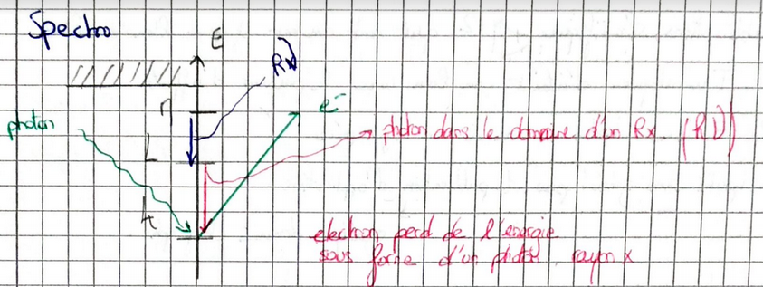

### Détection

WDX (WDS): détecteur dispersif en longueur d’onde. Très bonne résolution en énergie, jeu d’éléments à choisir au préalable, cristaux à déplacer (lenteur)EDX (EDS): détecteur dispersif en énergie. Moyenne résolution en énergie, pas de choix préalable sur les éléments à détecter, analyse rapide.

- Dispersion en énergie : utiliser les photons de la lumière et les trier en fonction de l'énergie du photon sur un semi-conducteur. Pas toujours de photons car XRF est en compétition avec des électrons Auger. On voit tous les élements.

- dispersion en longueur d'onde : le détecteur va permettre de compter les photons. Les photons arrivent au cristal analyseur et repartent vers le détecteur. Les rayons arrivent en parallèles 2d sinθ. Les chemins ont la même longueur entre la source, le cristal et le détecteur. Pas de spectre. On sélectionne les élements. Equation de Bragues.

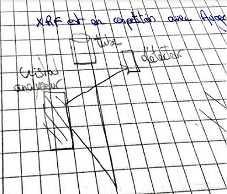

### Spectre XRF

Rayons X sont ceux de haute énergie. L'unité d'énergie est en keV en abscisse. En ordonnée on a une émission en Intensité du signal (AU ou cp ou cp/s). On représente l’intensité de fluorescence mesurée en fonction de l’énergie (eV, keV) ou de la longueur d’onde.

### Types de sources

1. on utilise un élément radioactif (100 euros)
2. tube à rayons x : on fait interagir des électrons avec une cible en métal (100K d'euros)

3. rayonnement synchrotron : appareil dans lequel on fait tourner des photons à la vitesses de la lumière (1 milliard d'euros)

### Utilité

La fluorescence permet une analyse élémentaire qualitative et/ou quantitativeIl existe des ensembles source/détecteur portables (pistolet) manipulables sur le terrain.Méthode peu sensible aux conditions de T, P,... et aux liaisons chimiquesMéthode non destructive

Infos diverses : Les éléments doivent avoir une couche L. Seulement à partir du Bore qu'on peut l'observer. Plus on avance dans le tableau, les résultats sont meilleurs pas de H, He, Li, Be et les plus légers. 

## Libs

### Qu'est-ce ?

Transfert électronique entre le continuum et une couche interne. Technique élémentaire : composition élémentaire de l'échantillon. Emission optique induite par laser. On fait une émission optique. Un électron est éjecté, un électron sera mis à sa place en émettant un photon proche UV-IR.

### Spectre

**Domaine spectral** : proche UV- IR

Spectre avec des longueur d'onde de **250 à 900 nm**. Beaucoup plus de pics et plus fins. L'excitation sera du au **laser**. La détection est une **caméra optique CCD**.

### Utilité

En Libs, on voit tous les éléments. Efficace sur les éléments légers. Différence entre XRF et Libs, le calcul des quantités. Libs se base sur la physique des plasmas. Plus compliqué pour doser.

## DRF

Diffraction des rayons X

## UV - Visible

### Qu'est-ce ?

On peut mesurer deux choses en UV-Visible : 

- absorption
- émission
  

La spectroscopie UV-visible (UV-vis) mesure l'absorption d'un rayonnement ultra-violet ou visible par une molécule. Cette absorption correspond à l’excitation des électrons impliqués dans les orbitales moléculaires vers des états excitésLes rayonnements UV-vis peuvent aussi être utilisés pour stimuler et mesurer la fluorescence émise par les molécules cibles

Le verre et le quartz absorbent toutes les ondes en dessous de 200nm. Il faut opérer avec un miroir sous vide. On se limite à la gamme de liaison pi et pi*. Les orbitales sont sigma sont plus énergétiques et donc en dessous de 200nm.

### Orbitales moléculaire

Un orbitale moléculaire est deux atomes qui ne vont pas être fixes l'un par rapport à l'autre mais vibre tant qu'on est pas au 0 absolu. En transférant de l’énergie à un électron on peut lui faire changer d’orbitale atomique.

- Molécule: assemblage d’atomes liés par des liaisons chimiques
- Liaison chimique = mise en commun d’e-dans des orbitales moléculaires
- Orbitale moléculaire: combinaison linéaire d’orbitales atomiques

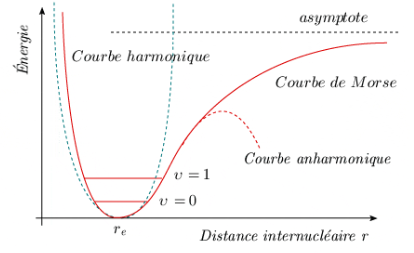

Toutes les orbitales ont une orbitale de basse énergie et des orbitales vacantes qui ont un plus grande énergie. Nous allons regarder depuis la haute occupé à la basse vacante. Une courbe de Morse par orbital moléculaire. La courbe représente l'énergie potentiel de la liaison. La dernière orbitale moléculaire remplie est nommée HO (haute occupée)La première orbitale moléculaire vide est nommée BV (basse vacante)Ce sont les orbitales frontières. Comme pour les orbitales atomiques, seules les orbitales de plus basse énergie sont rempliesLes orbitales de plus haute énergie sont vides à l’état fondamentalComme pour les orbitales atomiques, en transférant de l’énergie à un électron, on peut le faire changer d’orbitale moléculaire.

Lorsque l'on regarder une transition d'une orbitale excité vers un orbitale mois excité, ça provoque de la luminescence. 
La fluorescence se compte à une dizaine de nano-seconde. La longueur d'onde est plus grande à la descente qu'à la montée.

### Spectre

On représente A (absorption) ou є(coefficient d’absorption molaire du soluté) en fonction de la longueur d’onde.

Limites: faible concentration, pas de réaction entre solvant et soluté, pas de dissociation, pas d’autre soluté ou solvant absorbant, lumière monochromatique. Marche très bien si le minéral est dilué.

Les transitions détectées sont généralement π→n ou n→π* caractéristiques de nombreux de composés organiques.Les transitions σ→σ* et n→σ* sont trop énergétiques pour être facilement observées ( opération sous vide). Il faut aussi connaître les choses qu'on étudie. Ce n'est adapté pour savoir ce qu'il y a dans une solution.

Certaines longueurs de vibrations sont autorisés et d'autres sont interdit. Plus on monte en énergie, plus le va et vient de l'atome sera plus grand. On envoie un photon qui va permettre de montée un électron sur une orbitale moléculaire supérieure et sa distance de va et vient sera plus grande. L'émission est en IR. 

Détecteurs : CCD. Matériau qui reçoit un photon fait une impulsion électrique. Qui va se voir en IR ou en UV.

## IR

### Qu'est-ce ?

En IR on regarde l'absorption. Le photon doit avoir la bonne énergie pour faire monter l'électron. On a plus de place d'avoir des signaux séparés dans l'IR que dans l'UV. La spectroscopie IR mesure l'absorption d'un rayonnement infrarouge par une molécule. Cette absorption correspond à l’excitation des mouvements de vibration et de rotation des molécules.Deux chemins optiques suivis par deux faisceaux d’ondes IR. L’un traverse l’échantillon, l’autre non. Le rapport d’intensité entre les deux faisceaux caractérise l’absorption des IR par l’échantillon. Le miroir change la longueur du chemin des ondes selon qu’elles passent par le miroir fixe ou mobile. L’onde incidente est cohérente donc il se produit des interférences positives ou négatives.La source est polychromatique, toutes les longueurs d’ondes IR (proche et moyen) sont présentes en même temps. On regarde l'énergie entre deux moment de vibration d'une même orbital.

### Domaine position - domaine fréquence

Interféromètre : système de mesure où on envoie la lumière polychromatique sur un miroir semi-transparent. L’interférogramme est la représentation de l’intensité reçue par le détecteur en fonction de la position du miroirLa Transformation de Fourier permet de décomposer l’interférogramme en une somme de fonctions sinusoïdales, représentant chacune une onde donnée. Nécessite moins d’optiques, notamment d’optiques dispersives, donc maximise l’intensité transmise par le système: plus de photons sur l’échantillonLe mouvement du miroir est très rapide (s), on peut accumuler les spectre (les sommer avant transformation de Fourier)La position du miroir est repérée par laser dans le domaine visible: précis et répétable.

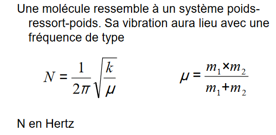

N =  nombre de vibrations par seconde. Donc utilisation du nombre d'onde.

Les valeurs en Hertz sont trop grandes, on les exprime en nombre d’onde (cm-1) (division par c, célérité de la lumière dans le vide). 

V_ = N/C (cm/s)

### Spectre

Le spectre représente les liaisons entre deux types d'atome. On peut donc connaître la nature d'un élément mais pas la quantité. On voit les liaisons mais pas toutes. On voit les liaisons qui provoquent un moment dipolaire sur les deux atomes. Si les atomes ne sont pas identiques, (diatomique), il n'y a pas de moment dipolaire. Si il n'y a pas de moment dipolaire ni de variations, on ne voir rien avec l'infra-rouge.

### Mouvements

Il faut observer ça avec trois atomes (H2O, CO2). Sur l'eau, on a une charge moins sur l'oxygène et une charge plus sur l'hydrogène. On peut faire trois rotations, trois translations et trois déformations (symétrique, anti-symétrique et changement d'angle qui va entraîner un changement dipolaire). Des vibrations seront invisibles et d'autres seront visibles. Une vibration se verra d'autant plus, la vibration sera grande. Des vibrations auront le même niveau d'énergie **niveaux dégénérés**. Chacun des atomes de molécules ont des degrés de liberté. Il arrive qu'il y ai des rotations qu'on ne voit pas bien. Pour les molécules linaires, on ne voit pas les rotations. Un atome a trois coordonnées dans l’espace, donc trois degrés de libertéUne molécule n’est pas un assemblage rigide, donc son degré de liberté total est la somme des degrés de liberté de ses n atomes constituants: 3n.

* 3n - 6 quantité de vibration dans une molécule
* 3n - 5

Certaines vibrations peuvent être situé au même endroit. Grande gamme spectrale avec des pics bien définis.

Problème : l'eau absorbe très bien l'IR. Et des molécules sont inactives.

## Raman

### Qu'est-ce ?

En Raman, on va regarder les mêmes niveaux de vibrations des mêmes liaisons moléculaires. En Raman, on fait une **diffusion inélastique** des photons. Le photon a juste donné ou prit une énergie et continu sa route. La diffusion est 10Gx moins probable que l'IR. Il faut un laser. La diffusion Raman est une diffusion (le photon n’est pas annihilé) inélastique (avec perte ou gain d’énergie) pendant laquelle la molécule cible change de niveau de vibration ou de rotation.La longueur d’onde du faisceau incident ne doit pas correspondre à un saut d’énergie quantifié.

Soit il fait monter un niveau d'excitation soit il le fait descendre. Il est beaucoup plus intense vers le haut que vers le bas où il gagnera de l'énergie. Le principe de la diffusion Raman se base sur la variation de polarisabilité de la molécule sous l’effet du champ électrique de la radiation incidente.Pour avoir un effet Raman, la vibration de la molécule doit produire une variation de polarisabilité dont la dérivée est non nulle.

### Liaisons actives

Le principe de la diffusion Raman se base sur la variation de polarisabilité de la molécule sous l’effet du champ électrique de la radiation incidente. Pour avoir un effet Raman, la vibration de la molécule doit produire une variation de polarisabilité dont la dérivée est non nulle.

### Mesures

Le qui est caractéristique de l’effet Raman est le déplacement en longueur d’onde de la radiation diffusée. Ce déplacement ne dépend pas de la longueur d’onde de la radiation incidente

### Spectre

Le spectre Raman montre les mêmes vibrations que l'IR. Les ordonnées sont en I (intensité). La polarisabilité de la liaison est une dérivée non nulle à la position de repos de la vibration. Même pour des liaisons diatomiques. Elle ne doit pas être la même entre de une vibration et une autre. (antisymétrique ne marche pas pour une molécule linéaire). Il peut potentiellement avoir de la fluorescence. On voit dans le Raman la même gamme spectrale que l'IR.

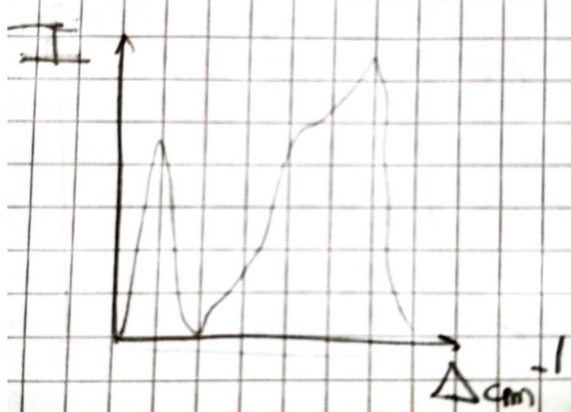

### Spectromètres Raman en transformée de Fourier

Pour éviter les phénomènes de fluorescence on peut irradier dans le proche infrarouge et utiliser une détection par interféromètre pour mesurer les déplacements en longueur d’onde de la radiation diffusée.

### Intérêt de la spectroscopie Raman

- Non-destructif
- Peu de préparation
- Mesures in-situ
- Indépendant de λ excitatrice
- Efficace sur les molécules diatomiques homonucléaires
- Efficace en présence d’eau

### Limites

- Fluorescence d’un composé de l’échantillon
- Décomposition par échauffement
- Réactions photochimiques

Détecteur :  CCD

## Mossbauer : résonance nucléaire sans recul

### Qu'est-ce ?

Absorption emission de même énergie par le noyau et se fait sans recul (même énergie) entre l'absorption et l'émission.
On va regarder le niveau d'énergie dans le noyau. On va regarder les niveaux d'énergie des nucléons entre eux.
Un noyau excité va se relaxer par émission d’un rayon γ. Ce rayon γ va exciter un noyau identique qui va lui-même se relaxer par émission d’un rayon γ de même λ. C’est un phénomène de résonance qui ne peut se faire que si les noyaux ne sont affectés par aucun recul qui provoquerait des pertes d’énergie. Si on change le nombre de neutron on change le niveau d'énergie du noyau. Technique qui va sonder les isotopes d'un élément donné. Le noyau d'un isotope donné va recevoir un photon et le noyau va s'exciter et va redescendre et émettre un photon. 
Les raies d’émission n’ont pas une énergie unique, elles ont une dispersion autour d’une valeur moyenne. Cette dispersion est due au principe d’indétermination d’Heisenberg (durée de vie finie du niveau excité) et à l’effet Doppler (agitation thermique).

### Résonance γ nucléaire

L’élargissement thermique des raies permet un recouvrement. Les basses T devraient limiter la résonance: ce n’est pas le cas

Si un noyau est lié de manière rigide au réseau, alors le recul doit affecter tout le système cristallin. La masse du solide rend ce mouvement extrêmement faible, donc le recul nul. Il en va de même pour le noyau absorbeur.
Tous les atomes ont une fraction f qui présente cette caractéristique (f=facteur de Lamb-Mössbauer). f augmente quand T diminue.

Il existe dans les solides une fraction du noyau qui est attaché à leur voisin. La résonance nucléaire s'explique pour les noyaux car ils sont liés de façon rigide au réseau cristallin. Cela marche plus dans certain isotopes que d'autres, et le fer.

### Forme des raies d'émission et d'absorption

Les raies d’émission n’ont pas une énergie unique, elles ont une dispersion autour d’une valeur moyenne. Cette dispersion est due au principe d’indétermination d’Heisenberg (durée de vie finie du niveau excité) et à l’effet Doppler (agitation thermique)

Si on met des orbitales s dans le noyau, on va déplacer les deux niveaux orbitales. La largeur de la raie d’absorption est très faible (10-8 eV) par rapport à son énergie (~x10keV) On cherche donc à sonder la variation d’absorption en fonction de l’énergie incidente, avec une très forte résolution sur l’énergie incidente.

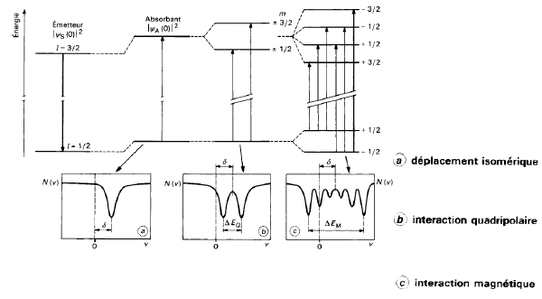

Mossbäuer va choisir un noyau en particulier dans un environnement chimique. **Technique de spéciation**. Car les niveaux d'énergie d'un noyau change en fonction de ce qu'il se passe autour. Connaître son degré d'oxydation, nombre de voisins, nature des voisins, distances et angles de ces voisins.

### Source γ

La source est composé d’un noyau parent radioactif se décomposant en un noyau fils stable identique à celui analysé (Co57 donnant du Fe57 pour analyser un échantillon de Fe). Le noyau fils est généralement excité et se relaxe en émettant un rayon γ. La durée de vie du noyau fils est infinie, donc la raie d’émission est très précise (incertitude d’Heisenberg). On doit mesurer l’absorption en fonction de l’énergie. Pour moduler précisément cette énergie on utilise l’effet Doppler en bougeant la source radioactive. On représente la variation de transmission de flux de photons en fonction de la vitesse de déplacement de la source.

### Spectre

On représente la variation de transmission de flux de photons en fonction de la vitesse de déplacement de la source.

On cherche un élement pair radioactif qui se désintègre dans un isotope à analyser et dans un son état excité.

Si on a une énergie de 10kev, on a une résolution de 10-7 keV. 

On va donner à la source un mouvement oscillant. Pour faire la même chose que l'effet de Doppler. L'axe des abscisse est en mm/s. 

### Contraintes

- sur les solides
- il faut un facteur f important et donc le travailler à plusieurs température.
- trouver un élément pair suffisamment exciter et une durée de demi-vie suffisante du père pour l'isotope radioactif.
- manip longue qui peut prendre une semaine 

On fait le fer57. Il se fait à la température ambiante. L'étain également. On regarde les autres éléments en azotes liquide ou en hélium liquide.

## XAFS : X-Ray Absorption Fine Structure

### Qu'est-ce ?

La spectroscopie d’absorption des rayons X est l’étude des variations des structures fines à proximité du seuil d’absorption d’un élément. Cette zone permet de sonder la spéciation d’un élément cible.
Lors d'une absorption, le photoélectron émis est rétrodiffusé par les atomes voisins, et l'onde rétrodiffusée vient interférer avec la densité électronique de l'atome absorbeur en modifiant l'absorption et la diffusion de cet atome.Les interférences dépendront donc de l’atome cible de la nature des voisins et des distances à ces voisins. 

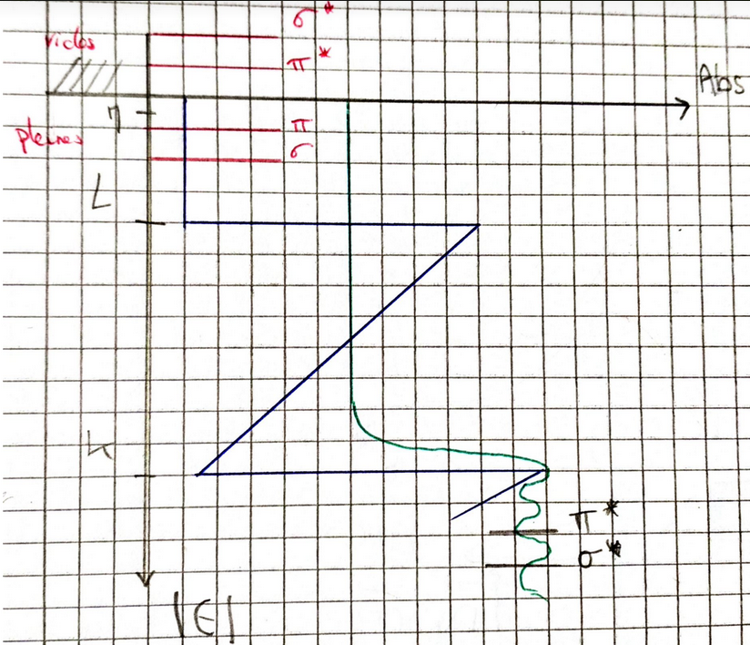

C'est une techniques de spéciation, Connaître son degré d'oxydation, nombre de voisins, nature des voisins, distances et angles de ces voisins. Déformation d'un nuage électronique par un électron provenant des voisins.

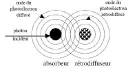

### Detection du signal d'absorption

lors d'une absorption, le photoélectron émis est rétrodiffusé par les atomes voisins, et l'onde rétrodiffusée vient interférer avec la densité électronique de l'atome absorbeur en modifiant l'absorption et la diffusion de cet atome. Les interférences dépendront donc de l’atome cible de la nature des voisins et des distances à ces voisins. L'électron revient vers le noyau initial avec les informations des voisins (bleu au départ et revient vert car noyau jaune).
En absorption (A=log(I0/I)). Très précis, rapide, limites de détection moyennes. En fluorescence: Très bonnes limites de détection, complications supplémentaires (probabilité de fluorescence, autoabsorption).

### Domaines des spectres XAFS

A partir du signal où on reconnaît les voisins avec EXAFS, on fait des hypothèse et on les simule. XANES permet de tout voir dans la globalité : identification de la spéciation par comparaison avec des standards. EXAFS permet de déterminer la nature des voisins, la distance des voisins et la géométrie du site.

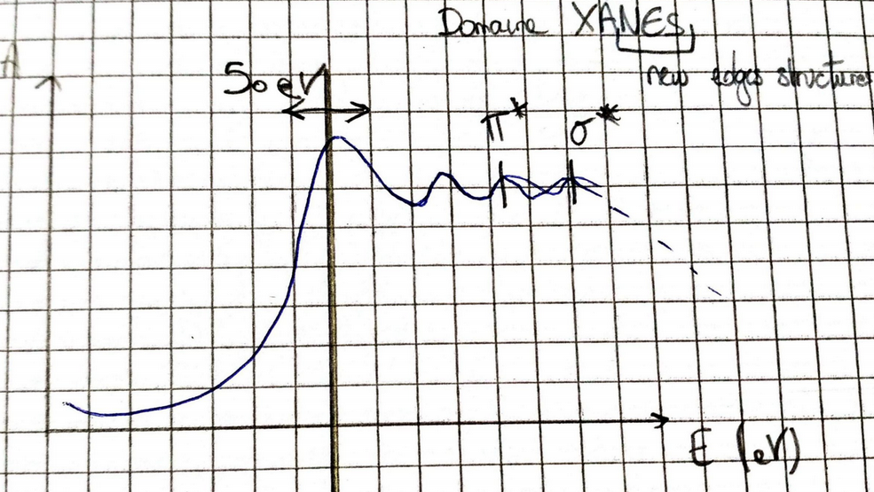

Il faut envoyer des rayons X monochromatique sur l'échantillon. C'est une technique de synchroton. Rayonnement généré par l’accélération de particules chargées (e- ou e+). Décalage en énergie par effet Doppler (particules circulant à une vitesse relativiste). Rayonnement généré par l’accélération de particules chargées (e-ou e+).Décalage en énergie par effet Doppler (particules circulant à une vitesse relativiste)

Si c'est trop dilué on ajoute un détecteur de fluorescence X. On peut l'observer sur liquide, gaz et solide.

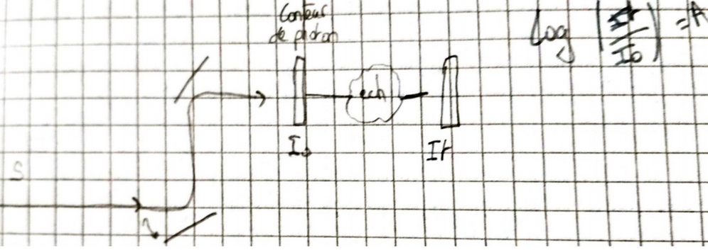

## EELS : Electron Loss Spectroscopy

### Qu'est-ce ?

EELS = Electron Energy Loss Spectroscopy ou spectroscopie des pertes d’énergie. Détection de la perte d’énergie subie par des électrons traversant un échantillon mince. Ces pertes d’énergie reflètent les excitations possibles de la matière traversée.

On utilise un microscope électronique à transmission. Certains électrons vont perdre plus ou moins de l'énergie. Il vont être dévié selon leur énergie. Il faut que le MET fasse de la perte d'énergie.

### Niveaux d'énergie

- Phonons: vibrations atomiques dans le solide = énergie thermique (~1eV)
- Plasmons: vibration résonante des électrons de valence du solide (~5-30eV)
- Ionisations: éjection d’électrons dans le continuum  (~x10eV →~x10keV)
- Rayonnement de freinage: décélération des électrons par interaction avec le champ électrique du noyau.

### Spectres EELS

Les pertes d’énergie dépendent de la nature des éléments chimiques et des liaisons dans lesquelles ces éléments sont engagés

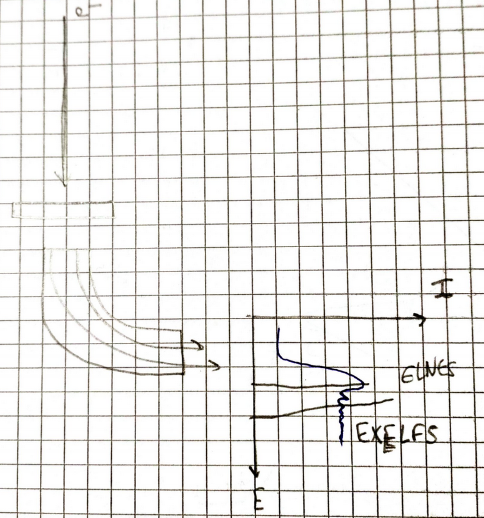

### Images et pertes d'énergie

Les électrons élastiques ne permettent pas de visualiser le tube de C. L’image basée sur les électrons ayant perdu l’énergie correspondant à l’énergie de liaison entre les électrons et le noyau des atomes de C permet de visualiser le tube.

### Avantages et inconvénients

Inconvénient : 

- on ne peut pas faire de liquide ou de gaz car sous vide.
- préparation de l'échantillon
- on ne peut pas voir les choses trop dilués

Avantages : 

- toutes les Universités ont un MET
- résolution spatiale et imbattable (on peut voir les atomes)

## RMN Résonance Magnétique Nucléaire

### Qu'est ce ?

La spectroscopie par résonance magnétique nucléaire RMN (NMR an anglais) est fondée sur la mesure de l'absorption d'un rayonnement radiofréquence par le noyau des atomes. L'environnement local autour d'un noyau donné dans une molécule va perturber le champ magnétique local exercé sur ce noyau et affecter son énergie de transition. Cette dépendance permet la détermination de la structure moléculaire. Somme vectorielle de tous les nucléons. Technique isotopique. Tout ce qu'il y a autour du noyau va être perturbé par son champ magnétique. Ce champ est un objet quantique. On aura des niveaux d'énergie. Ce sont ces énergies absorbées que l'on va observer avec la radio-fréquence. **Technique moléculaire**

### Spin nucléaire

Les noyaux possèdent un nombre quantique de spin nucléaire entier ou demi-entier. Seul les noyaux ayant un nombre pair de protons et de neutrons on un spin nul. Le spin peut être compris comme un vecteur de moment angulaire. Dans le cas général, la somme des vecteurs moment angulaire de spin nucléaire est nulle. Le nombre de spin donne le nombre d'état possible. Pour n : [-n, n+1,...+n].

Le noyau est une particule chargée. Une particule chargée accélérée crée un champ magnétique. Le noyau a donc un moment magnétique nucléaire dû au spin. Dans un champ magnétique intense (B0), les moments magnétiques nucléaires vont s’orienter en fonction du champ magnétique imposé. La somme de tous les spins est nulle.

Les moments magnétiques nucléaires ne vont pas s’aligner avec le champ magnétique imposé, ils vont être animés d’un mouvement de précession à une vitesse angulaire ω0=-γB0.

### Introduction d'un champ magnétique B1 normal à B0

Nous voulons voir l'effet du changement de spin à 0. On voit la résultante en créant une impulsion, cela va permettre de tous les grouper.
Le nombre d’angles possibles entre le moment magnétique nucléaire et B0 dépend du nombre de spin (I). Il y a 2I+1 valeurs possibles (I, I-1, I-2,... -I). Chaque angle caractérise un état d’énergie. L'impulsion est sinusoïdale.

En présence d’un champ B1 sinusoïdal de fréquence ω0, les photons correspondant àce champ ont l’énergie permettant d’exciter le spin nucléaire (basculement du spin). En présence d’un champ B1sinusoïdal de fréquence ω0, les moments magnétiques nucléaires peuvent acquérir une cohérence de phase (somme non colinéaire à B0). 

### Détection

On peut:

- soit balayer les fréquence et mesurer l’absorption de l’échantillon pour connaître les fréquences correspondant à des basculements de spins
- soit mesurer la relaxation suite à une impulsion de B1

On peut utiliser la même bobine pour exciter et pour observer la réception. Ce qui est émit et à la même énergie que ce qui est absorbé. Les vitesses de retour est fonction de l'angle et du temps que les spins retournent à la normale.

### Spectre 

Le spectre RMN dans le domaine du temps dépend du champ B0appliqué. Pour pouvoir comparer les spectres d’un appareil à l’autre il faut s’affranchir des contraintes expérimentales particulières. On comparera donc le signal de l’échantillon à celui d’un standard. Le spectre en fréquence dépend de B0.

La position du signal d’une espèce chimique par rapport à celle du standard sera appelé déplacement (δ). δ=(νEl-νstd)/ν0ν=ІωІ/2π. 

Les déplacements sont très faibles (10-6) et seront donc exprimés en millionièmes, ou parties par million (ppm).

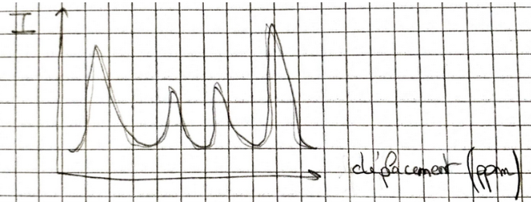

### Que représente le déplacement chimique ?

Proton seul : pas d'électron, le champ ressenti au niveau du noyau est celui émis par l'aimant.

H dans une molécule: les électrons de la molécule blindent le noyau qui ressent un champ B0 plus faible que le champ B appliqué par l’aimant. Il faut augmenter B pour que B0 assure la résonance (ω0=-γB0). 

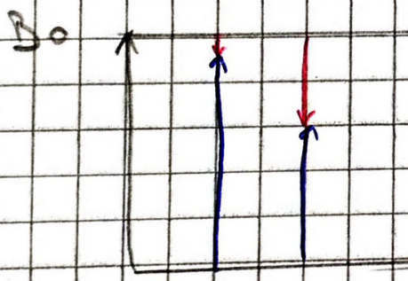

C'est pour cela, que l'on va retrouver différentes fréquence sur le spectre. La vitesse de rotation est proportionnel à ce qu'il ressente. Plus ils sont blindés, plus leur rotation est faible, plus il sont à gauche sur le spectre. Plus le voisin attire à lui des électrons moins H est blindé, plus il tournera vite.

Comme Si blinde le plus fortement, on a choisi le T.M.S. (Tétraméthylsilane, Si(CH3)4) comme standard. Par comparaison, les autres liaisons apparaîtront déblindées (δ positifs).

### Ordres de grandeur

- B0 : 1 à 20 T
- B1 : 10-3 T
- durée d'impulsion : 10µs
- temps de relaxation : quelques secondes à quelques minutes

### Utilisation

Si on a un corps pure, la technique est extrêmement puissante. Elle n'est pas très courante. Elle est plus courante en partie minérale. Cette technique est sensible aux problèmes d'anisotropie, les solutions sont préférables. Les solides sont aussi possible mais de préférence les poudres sont utilisées.

Utilisé en imagerie médicale. Le principe de base est la RMN. Pour la localisation spatiale des protons, l’IRM utilise une propriété habituellement traitée comme un défaut: si B0 n’est pas constant le déplacement ne sera pas le même pour tous les protons. Le champ magnétique est absolument homogène en IRM. En RMN, il varie mais on connaît les valeurs en chaque point. On peut localiser spatialement où le signal à été émis. On regarde que le signal de l'hydrogène dans notre corps en IRM. Il va regarder les tissus mous enrichis en eau. Contrairement au scanner qui travaille sur les parties durs (os).

## RPE Résonance Paramagnétique Électronique

### Qu'est ce ?

La spectroscopie RPE mesure l'absorption d'un rayonnement micro-onde par un électron non apparié quand il est placé dans un champ magnétique intense.RPE = RSE (résonance de spin électronique), ESR et EPR en anglais. C'est une résonance, l'absorption sera la même que l'émission. On regarde un éléctron qui doit être seul dans son orbital.

### Concepts de base

Les concepts de base sont analogues en RMN et RPE.Le spin électronique peut être compris comme un vecteur de moment angulaire.Le spin électronique vaut +1/2 ou-1/2. Les concepts de base sont analogues en RMN et RPE mais:

- la masse de l’électron est beaucoup plus faible que celle du proton donc les champs nécessaires sont plus faibles (0.1 à 1T)
- les différences d’énergie entre les niveaux de spin sont plus élevées, donc les fréquences utilisées sont plus élevées (GHZ), nous sommes dans les micro-ondes et pas dans les radio-fréquences.

### Spin électronique dans un champ magnétique

Les moments magnétiques électroniques ne vont pas s’aligner avec le champ magnétique imposé, ils vont être animés d’un mouvement de précession à une vitesse angulaire ω0=-γB0. (ν0=Іγ.B0І/2π).

### Type d'analyse

Contrairement à la RMN, le RPE se fait principalement en ondes continues (RMN en mode pulsé). C’est dû principalement àla difficulté de création d’ondes de durée de vie assez courte (relaxation beaucoup plus rapide en RPE) associées à des champs plus intenses.

### Enregistrement du spectre

ν0=Іγ.B0І/2π

En pratique on fait varier le champ magnétique (plus précis) et on enregistre l’absorption à fréquence constante. Les abscisses du spectre sont donc graduées en Gauss (10-4T). Pour augmenter la sensibilité de détection on envoie un fréquence légèrement modulée, ce qui permet de mesurer directement la dérivée de l’absorption (axe des ordonnées).

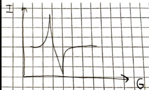

### Paramètres lus sur le spectre RPE

On va mesurer :

- amplitude pic-à-pic (nombre d'électron non couplés). 
- largeur pic-à-pic (concentration)  
- la position du facteur g (facteur de Landé, degré de localisation des électrons).

### Difficultés des spectres RPE

Chaque transition d'un multiplet donne naissance à une raie d'absorption. Les électrons non appariés sont très mobiles et sont donc très sensibles à l'environnement. Les spectres RPE n'ont pas de table comparables aux tables de déplacement de la RMN.

