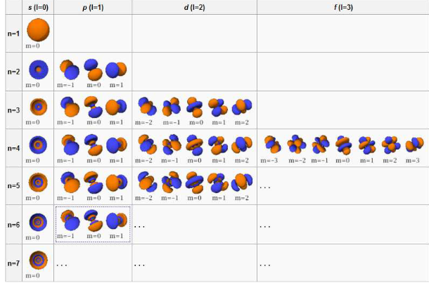

# Techniques

Préparation d'échantillons : lithopréparation, séparations, extractions...

Observations et analyses : techniques chimiques, physiques, spectrométrie (masse), spectroscopies (photons, électrons, protons, ions...)

Compréhension des résultats : statistiques, traitements d'images..

# Objectifs

- Savoir sur quelle technique se tourner pour résoudre un problème en géosciences
- Savoir reconnaître une technique à partir d'éléments limités (spectre, unités...)
- Comprendre les processus physiques sous-tendant les techniques d'analyse 
- Connaître les limites actuelles des différentes techniques
- Connaître les principales contraintes sur la préparation des échantillons

https://sourceforge.net/project/pymca 

Observation de la force électromagnétique. Toutes les particules se comportent avec une equation de rotation. Les caractéristiques spins sont les porteurs du magnétisme.

Liaison covalente : mise en commun de deux électrons

Agitation dans l'infrarouge

Atome = noyau + électrons occupant des orbitales atomiques qui ne sont pas des orbitales circulaires

Spin -> changement de rotation de l'axe d'une particule

En transférant de l'énergie à un électron, on peut aussi lui faire changer d'orbitale atomique

Règle de Klechkowski permettant de reconstruire l’ordre des énergies croissantes des énergies croissantes des sous-couches électroniques.

Molécule : assemblage d'atomes liés par des liaisons chimiques

Liaisons chimique : mise en commun d'électrons dans des orbitales moléculaires

Orbitale moléculaire :  combinaison linéaire d'orbitales atomiques

Comme pour les orbitales atomiques, seules les orbitales de plus basse énergie sont remplies. Les orbitales de plus haute énergie sont vides à l’état fondamental. Comme pour les orbitales atomiques, en transférant de l’énergie à un électron, on peut le faire changer d’orbitale moléculaire. Pour simplifier et par analogie avec les atomes: les noyaux sont formés de plusieurs nucléons qui peuvent occuper dans le noyaux des niveaux discrets d’énergie. Il existe donc un état d’énergie. Il existe donc un état fondamental (énergie minimale) et des états excités. En transférant de l’énergie à un noyau, on peut le faire passer dans un état excité. Les techniques spectroscopiques vont toutes faire interférer des ondes électromagnétiques avec les orbitales atomiques ou moléculaires ou encore atomiques ou moléculaires ou encore avec les spins électroniques ou nucléaires.

IRM : rayonnement du noyau d'hydrogène

Raman : niveau de vibration des molécules

IR : niveau de vibration de même molécules

Diffusion : électron qui change de phase, d'énergie ou de trajectoire

## Ondes électromagnétiques

représentent la propagation d’un champ électrique et d’un champ magnétique alternatifs et perpendiculaires. Sont portées par un photon.

3 caractéristiques chimiques : 

- techniques élémentaires : caractéristiques sur les éléments
- techniques moléculaire : caractéristiques sur la molécule
- spéciation : environnement chimique local

